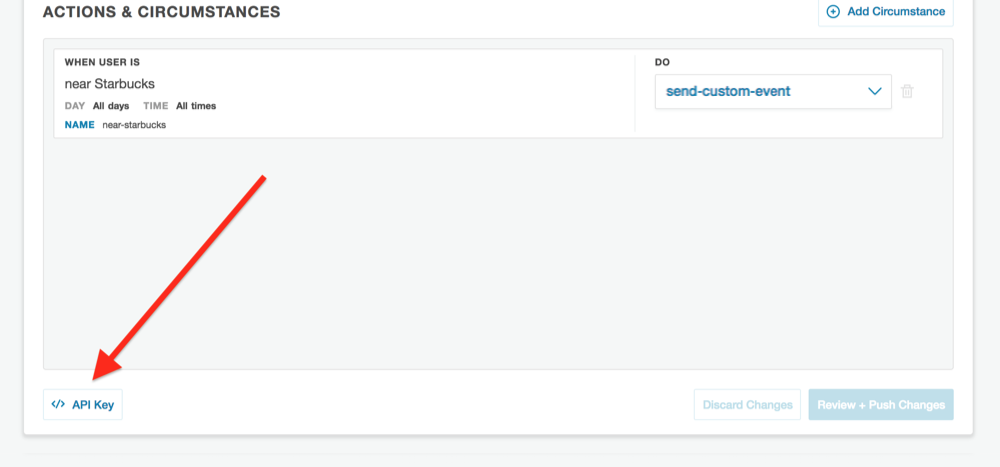

# Example

## Setup

### Add API Keys

**(1)** Locate your Factual Engine API Key from the [Factual Engine Dashboard](https://engine.factual.com/garage)

**(2)** Add Factual Location Engine API Key in [Configuration.java](src/main/java/com/factual/engine/braze/Configuration.java) where it says, `"Your Engine API Key here"`

**(3)** Locate your Braze API Key for your app from the [Braze Dashboard](https://dashboard.braze.com) in **Developer Console** under the **APP SETTINGS** tab.  Go to **Identification** and use the API Key listed for your app.

**(4)** Add your Braze SDK API Key to [appboy.xml](src/main/res/values/appboy.xml) where it says `Your Braze SDK API Key here`.

**(5)** Determine your [Braze Endpoint](https://www.braze.com/docs/user_guide/administrative/access_braze/sdk_endpoints/) and add it to [appboy.xml](src/main/res/values/appboy.xml) where it says `Your Braze SDK Endpoint here`

**(5)** In [Configuration.java](src/main/java/com/factual/engine/braze/Configuration.java) replace `"Your Braze User ID here"` and `"Your Braze User Email here"` to a test user id and user email which you can use to look up on Braze to ensure the data is being sent.

### Enable Push Notifications

The example app is setup to send a push notification using [Firebase](https://firebase.google.com/). The file [google-services.json](google-services.json) should be updated with you credentials and permissions.  [Click here](https://www.braze.com/docs/developer_guide/platform_integration_guides/android/push_notifications/integration/) to view how to configure Braze's push notifications.  Add your Cloud Messaging Sender ID to [appboy.xml](src/main/res/values/appboy.xml) where it says `Your Cloud Messaging Sender ID here`.

### Testing

If you'd like to test the integration, an example test is given. To run the test, fill out your information in [StubConfiguration.java](src/androidTest/java/com/factual/engine/braze/StubConfiguration.java). Change the `TEST_LATITUDE` and `TEST_LONGITUDE` variables to coordinates for a place which would trigger your engine circumstance.

### Explore

From here you can setup a Braze Campaign to trigger actions based on Engine custom events. [See here](https://github.com/Factual/engine-braze-integration#example) for an example of sending a push notification for when a user visits a coffee shop.
